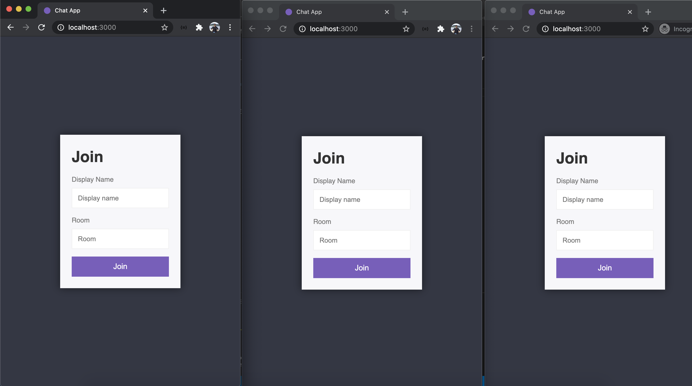
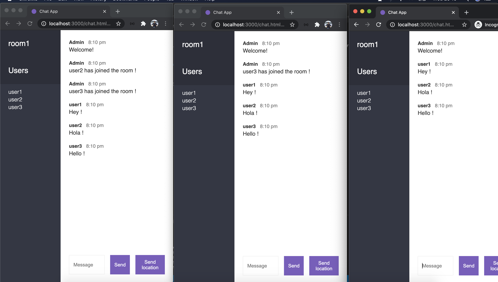
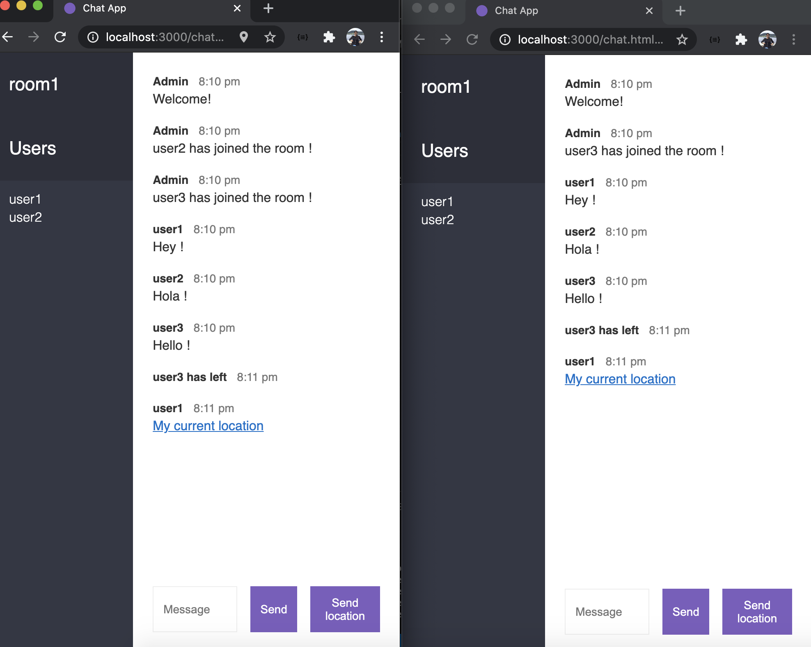
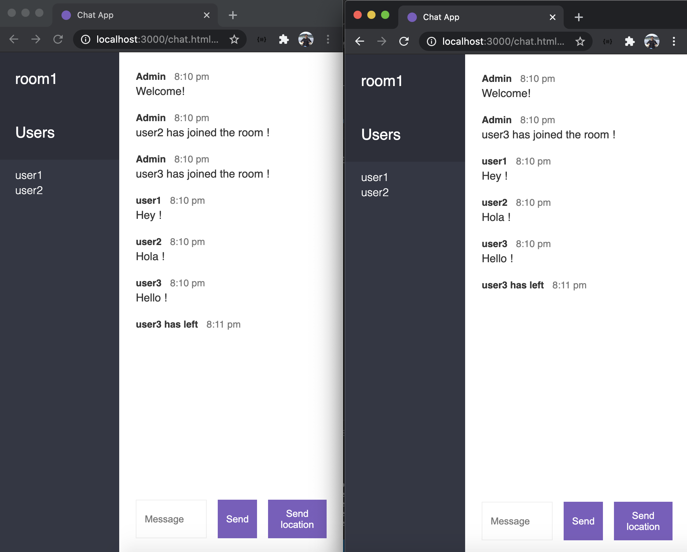

# Real-Time Chat App 

This ia a simple chat app in which the users can create room and chat with another through text messages . It is handcrafted with Node JS and socket API to provide the conversational experience 

##  Demo screenshots of Chat App

##  Reference 
https://www.udemy.com/course/the-complete-nodejs-developer-course-2/

